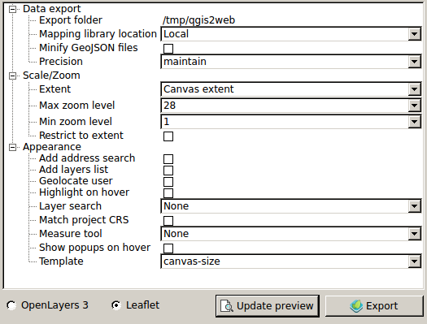

---
Sharing *SBU* Data with Web Mapping Tools
---
AKA  
Web Maps  
*For Inboxes*
---
*WHAT?*
---

---
*HOW?*
<p alight="center">

</p>
---


\+ QGIS2Web Plugin
---
## *Demo*
1. QGIS2Web Overview
1. Load ACLED Data
1. Formatting HTML Popup, The Hard Way
1. Routinely updating Data
---
### QGIS2Web Plugin
# *Overview*

---

---
# Layer Options

## *Popup fields*
### Specify how each field will be labelled in popups
## *Visible*
### Select whether the layer will be visible on map load. This only determines visibility - the layer will be loaded regardless of this setting
## *Encode to JSON*
### If unchecked, WFS layers will remain remote WFS layers in the webmap. If checked, the layer will be written to a local GeoJSON file
## *Cluster*
### Cluster point features

---

---
# Data Export  

## *Export folder*
### The folder where the webmap will be saved
## *Mapping library location*
### Select whether to use a local copy of OL3/Leaflet, or whether to call the library from its CDN
## *Minify GeoJSON files*
### Remove unnecessary whitespace from exported GeoJSON to reduce file size
## *Precision*
### Simplify geometry to reduce file size

---
# Scale/Zoom

## *Extent*
### Either match the current QGIS view or show all contents of all layers (only local GeoJSON and rasters, not WFS/WMS)
## *Max zoom level*
### How far the webmap will zoom in
## *Min zoom level*
### How far the webmap will zoom out
## *Restrict to extent*
### Prevent panning or zooming beyond the selected extent
---
# Appearance

## *Add address search*
### Add field to allow searching for locations (geocode)
## *Add layers list*
### Include list of layers (with legend icons, where possible)
## *Add measure tool*
### Include interactive measuring widget
## *Geolocate user*
### Show user's location on map

---
# Appearance cont.

## *Highlight on hover*
### Highlight features on mouseover
## *Layer search*
### Add option to search for values in layer field values
## *Match project CRS*
### Create webmap in same projection as QGIS project, otherwise the webmap is projected in EPSG:3857
## *Show popups on hover*
### Show popups when mouse hovers over features
## *Template*
### Select HTML template for webmap - add your own templates to the /qgis2web/templates directory in your .qgis2 folder

---


---
Formatting HTML Popups
---
Few things to remember
+ Convert to SQLlite
+ Concatinate fields with wrapping HTML
+ "html_exp"
---
```
 concat(
 '<h3>', "location", '</h3>
 <table>',
 '<tr><td>Type: <b>', "event_type" ,'</b></td></tr><tr>
 <td>Actor: <b>',"actor1",'</b></td></tr>
 <tr><td>Fatalities: <b>',"fatalities", '</b></td></tr>
 <tr><td>Source: <b>',"source",'</b></td></tr>
 </table>'
 )
```
---
Now that I've made a map how do I update it with a new dataset?
---
<p style="background-image: url(imgs/matrixCode.gif);"></p>

# With a few lines of `code`!

---
## Steps
  1. Convert to `geojson`
  1. Add padding to the `geojson`
  1. Update file name (if necessary) in the map's `index.html`
---
  1. Click the *Add Delimited Text Layer Option*
  1. Browse to the file called `ACLED-2016Sept.csv`
  1. Insure that long and lat are set correctly in the *X* and *Y* field
  1. Click *OK*
  1. Verify that the data has been added correctly
---
  1. Right click on the file in the Layers Panel
  1. Save As and Select the `geojson` Format
  1. Browse to your map's data folder and save the file
---
## JSON Padding
  
  1. Open this file in Notepad++
  1. At the beginning of your file add the following line of code  `var acled201609 =`
  1. Save your file as a `.js` instead of a `GeoJSON`
---

## Editing the `index.html` file
1. Open it in Notepad ++
1. Find the line that has this `<script src="data/json_ACLED2016Jan0.js"></script>`
1. Do a fined and replace for the old file name: `json_ACLED2016Jan0` with your new file `acled201609.js`
1. Save the `index.html` and refresh the map in the browser
